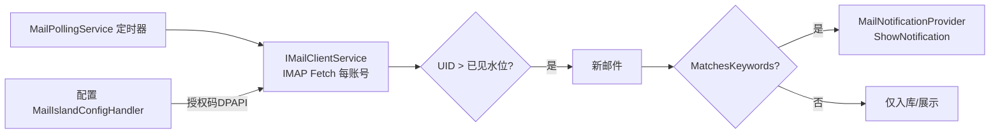

# MailIsland（邮箱）ClassIsland 插件 — 设计文档

* 日期：2026-09-02

* 状态：Approved（用户已确认）

* 作者：ywydog

* 参照工程：SystemTools（Programmer-MrWang，tag 2.5.1.0，仅作结构与 UI 语言参照，不引用其代码）

## 1. 项目目标

开发一个 ClassIsland 插件「邮箱」，用于：

1. 在 ClassIsland 设置中提供三页设置：**账号**、**邮件**、**消息提醒**。
2. 完成国内邮箱（非 OAuth）适配，走 **IMAP/SMTP** 授权码方式，支持邮箱预设与自定义服务器，并提供**连接验证**按钮。
3. 拉取并**显示邮件**，HTML 正文做净化后经转换渲染（适配深浅色）。
4. 通过**注册 ClassIsland 提醒服务**推送新邮件提醒，支持**关键词提醒**。

## 2. 已确认的技术决策

| 事项      | 决策                                     |
| ------- | -------------------------------------- |
| 邮件协议    | 仅 IMAP/SMTP（国内邮箱授权码，非 OAuth）           |
| HTML 渲染 | HtmlAgilityPack 净化 + 转换渲染（不依赖 WebView） |
| 账户数量    | 多账户                                    |
| 同步触发    | 提醒提供方内定时轮询                             |
| 关键词范围   | 发件人 + 主题 + 正文（可逐条配置范围）                 |
| 凭据存储    | Windows DPAPI 加密后存配置，明文仅内存             |
| 工程位置    | `/workspace/MailIsland`                |

## 3. 技术栈

* 目标框架：`net8.0-windows10.0.17763.0`

* UI：Avalonia（ClassIsland v2 基于 Avalonia）+ FluentAvalonia

* 依赖注入：Microsoft.Extensions.Hosting/DI（同参照仓库）

* 邮件：**MailKit 4.17.0**（IMAP 收件 / SMTP 发件）

* HTML：**HtmlAgilityPack**

* MVVM：CommunityToolkit.Mvvm

* 日志：Microsoft.Extensions.Logging

* CSPROJ（对齐参照仓库）：

```xml
<Project Sdk="Microsoft.NET.Sdk">
  <PropertyGroup>
    <TargetFramework>net8.0-windows10.0.17763.0</TargetFramework>
    <Nullable>enable</Nullable>
    <LangVersion>latest</LangVersion>
    <UseWPF>false</UseWPF>
    <UseWindowsForms>true</UseWindowsForms>
    <Platforms>x64</Platforms>
  </PropertyGroup>
  <ItemGroup>
    <PackageReference Include="ClassIsland.PluginSdk" Version="2.0.0.1" />
    <PackageReference Include="ClassIsland.Core" Version="2.0.0.1" />
    <PackageReference Include="Microsoft.Extensions.DependencyInjection" Version="8.0.0" />
    <PackageReference Include="Microsoft.Extensions.Hosting" Version="8.0.0" />
    <PackageReference Include="MailKit" Version="4.17.0" />
    <PackageReference Include="HtmlAgilityPack" Version="1.11.*" />
    <PackageReference Include="CommunityToolkit.Mvvm" Version="8.*" />
    <PackageReference Include="Microsoft.Extensions.Logging" Version="8.0.*" />
  </ItemGroup>
  <ItemGroup>
    <None Update="manifest.yml"><CopyToOutputDirectory>Always</CopyToOutputDirectory></None>
    <None Update="version.json"><CopyToOutputDirectory>Always</CopyToOutputDirectory></None>
    <None Update="icon.png"><CopyToOutputDirectory>Always</CopyToOutputDirectory></None>
  </ItemGroup>
</Project>
```

## 4. 架构与目录

参照 SystemTools 分层：

```
MailIsland/
├── manifest.yml                 # 插件清单（id/entrance Assembly/apiVersion）
├── version.json
├── MailIsland.csproj
├── icon.png
├── Plugin.cs                    # 入口：Initialize 注册设置页+提醒提供方+服务
├── SettingsPage/
│   ├── MailIslandSettingsPage.axaml(.cs)   # 容器页，含 TabView 三页
│   ├── Views/AccountTabPage.axaml(.cs)     # 账号页
│   ├── Views/MailTabPage.axaml(.cs)        # 邮件页
│   ├── Views/NotifyTabPage.axaml(.cs)      # 消息提醒页
│   └── SettingsViewModels/                 # 各页 ViewModel
├── Services/
│   ├── IMailClientService.cs               # MailKit IMAP 封装
│   ├── MailClientService.cs
│   ├── MailPollingService.cs               # 定时轮询托管服务
│   ├── MailNotificationProvider.cs         # NotificationProviderBase
│   └── CredentialService.cs                # DPAPI 加解密
├── ConfigHandlers/
│   ├── MailIslandConfigData.cs             # 配置模型
│   └── MailIslandConfigHandler.cs          # LoadConfig/SaveConfig(DPAPI)
├── Models/
│   ├── MailAccount.cs                      # 邮箱账号
│   ├── MailAccountPreset.cs                # 国内邮箱预设定义
│   ├── MailMessage.cs                      # 邮件消息
│   ├── KeywordRule.cs                      # 关键词规则
│   └── Enums.cs                            # 关键词匹配范围等
├── Converters/
│   └── HtmlRenderer.cs                     # HTML→Avalonia 转换渲染
├── Shared/
│   └── GlobalConstants.cs                  # 常量/文件夹/预设表
└── Assets/                                 # 图标等
```

## 5. 配置模型（ConfigHandlers/MailIslandConfigData.cs）

沿用参照仓库 `ConfigureFileHelper.LoadConfig/SaveConfig` + `INotifyPropertyChanged`（CommunityToolkit `[ObservableProperty]`），配置保存于插件配置目录：

```json
{
  "accounts": [
    {
      "id": "guid",
      "displayName": "QQ邮箱",
      "email": "user@qq.com",
      "imapServer": "imap.qq.com",
      "imapPort": 993,
      "imapUseSsl": true,
      "smtpServer": "smtp.qq.com",
      "smtpPort": 465,
      "smtpUseSsl": true,
      "encryptedPassword": "DPAPI-BASE64",
      "selected": true,
      "enabled": true
    }
  ],
  "pollIntervalMinutes": 5,
  "mailCountLimit": 50,
  "notifyEnabled": true,
  "keywordRules": [
    { "keyword": "考试", "matchScope": "All", "enabled": true }
  ]
}
```

* `encryptedPassword`：授权码经 `CredentialService.Encrypt()/Decrypt()`（DPAPI `ProtectedData.Protect/Unprotect`，Scope=CurrentUser）存储。

* 明文授权码只在内存与输入框短暂存在。

## 6. 国内邮箱预设（Shared/GlobalConstants.cs）

内置预设表（全部授权码、非 OAuth），供账号页下拉选择，切换到预设自动填充服务器：

| 预设     | 邮箱          | IMAP 服务器/端口              | SMTP 服务器/端口              |
| ------ | ----------- | ------------------------ | ------------------------ |
| QQ邮箱   | \*@qq.com   | imap.qq.com:993(SSL)     | smtp.qq.com:465(SSL)     |
| 163邮箱  | \*@163.com  | imap.163.com:993(SSL)    | smtp.163.com:465(SSL)    |
| 126邮箱  | \*@126.com  | imap.126.com:993(SSL)    | smtp.126.com:465(SSL)    |
| 新浪邮箱   | \*@sina.com | imap.sina.com:993(SSL)   | smtp.sina.com:465(SSL)   |
| 搜狐邮箱   | \*@sohu.com | imap.sohu.com:995(SSL)   | smtp.sohu.com:465(SSL)   |
| 阿里企业邮箱 | 自定义         | imap.qiye.aliyun.com:993 | smtp.qiye.aliyun.com:465 |
| 腾讯企业邮箱 | 自定义         | imap.exmail.qq.com:993   | smtp.exmail.qq.com:465   |
| 网易企业邮箱 | 自定义         | imap.ym.163.com:993      | smtp.ym.163.com:465      |
| 自定义    | 任意          | 用户填写                     | 用户填写                     |

> 预设仅提供服务器/端口，账户密码/授权码由用户输入，绝无默认值。仅纳入**无需 OAuth** 的国内主流邮箱；含需要 OAuth/IMAP 需额外开启的（如 Gmail）不在预设中。

## 7. 服务设计

### 7.1 IMailClientService（Services/MailClientService.cs）

封装 MailKit `ImapClient`：

* `Task<bool> VerifyConnectionAsync(MailAccount, string plainPassword, CancellationToken)` — 用于连接验证按钮：Connect(SSL/TLS) + Authenticate(PLAIN)，成功返回 true，异常携带中文错误。

* `Task<List<MailMessage>> FetchRecentAsync(MailAccount, CancellationToken)` — 打开 INBOX，`Fetch` 最近 `mailCountLimit` 封（UID、Envelope、Flags、BodyStructure），仅拉取 Header + 正文预览；正文 Html/Text 分开。

* 连接策略：优先 SSL 直连；失败时可尝试 STARTTLS；授权码模式用 `SaslMechanismPlain`。

* 邮件正文读取：HTML 部分转字符串给 `HtmlRenderer`；纯文本部分直接使用。

* 所有网络操作异步、可取消；捕获并转换异常文案（中文）。

### 7.2 MailPollingService（IHostedService）

* 后台托管服务，`services.AddHostedService<MailPollingService>()`。

* 循环：`while(!stoppingToken)` 延迟 `pollIntervalMinutes` 分钟 → 对有 `enabled` 的账户逐账号 `FetchRecentAsync` → 记录每个账号最近已见 UID 于内存（避免重复提醒）。

* 新邮件（UID 大于已见水位）→ 交给 `MailNotificationProvider` 判断关键词并发送提醒。

* 任一账户连接失败不中断整体，记录日志并 continue。

* 触发立即一次（启动后当 start）。

### 7.3 MailNotificationProvider（NotificationProviderBase）

* `[NotificationProviderInfo(GUID, "邮箱新邮件提醒", ...)]`。

* 继承 `NotificationProviderBase`，`Initialize` 中注册：`services.AddNotificationProvider<MailNotificationProvider>()`（SDK v2 泛型设置载体可用 `NotificationProviderBase<TSettings>`，设置为其内部 UI 或复用提醒页）。

* 对外暴露 `void NotifyMailAsync(MailMessage, MailAccount)`：组装 `NotificationRequest`（标题=账号显示名+发件人，内容=主题+正文预览）→ `ShowNotification(request)` / `ShowNotificationAsync`。

* 关键词判定：`bool MatchesKeywords(MailMessage, KeywordRule[])` — 逐条规则，按规则 "matchScope"（All / Sender / Subject / Body）对 发件人(姓名+邮箱)/主题/纯文本正文 做 `Contains`（忽略大小写），任一命中即触发。

## 8. 三次设置页 UI（参照 ClassIsland 本体设计语言）

沿用 ClassIsland 的 `SettingsPageBase` + `ci:FluentIcon` + FluentAvalonia `SettingsExpander/ExpanderItem` + 动态主题资源（`LayerFillColorDefaultBrush`、`TextFillColor*Brush`），适配深浅色。

### 8.1 账户页（AccountTabPage）

* 顶部：账号列表（`ItemsControl`/`ListBox`），每条显示 显示名/邮箱，选中增改。

* 控件：`新增账号` / `删除` 按钮。

* 当选中/新建账号时显示：

  * 预设下拉（ComboBox，选项来自 `GlobalConstants.Presets`，含「自定义」）

  * 显示名、邮箱地址、授权码（PasswordBox）

  * IMAP 服务器/端口/SSL、SMTP 服务器/端口/SSL（预设自动填充，可改）

  * **连接验证按钮**：`Button` 调用 `IMailClientService.VerifyConnectionAsync`，进行中 `ProgressRing`，结果用 `ContentDialog`/内联文本提示「连接成功」或中文错误。

  * 启用开关（参与轮询）。

* 修改即写入配置（`PropertyChanged` 自动保存）。

### 8.2 邮件页（MailTabPage）

* 顶部：账号选择（ComboBox，默认选中第一个 enabled）。

* 左侧/上方：邮件列表（ListBox/DataGrid 简化版），列：发件人、主题、时间、未读标记（粗体）→ 绑定 `ObservableCollection<MailMessage>`。

* 刷新按钮（立即拉取所选账号）。

* 下方/详情区：选中邮件显示：发件人/收件人/时间/主题/正文；

  * 正文 HTML → `HtmlRenderer` 转换渲染：净化不安全标签→按 Avalonia TextBlock/StackPanel 组装（标题/段落/链接可点击），纯文本直接显示。

  * 深色适配：文本用 `TextFillColorPrimaryBrush`；链接用主题强调色。

* 未读状态显示。

### 8.3 消息提醒页（NotifyTabPage）

* `SettingsExpander`：

  * 「启用新邮件提醒」ToggleSwitch（绑 `NotifyEnabled`）。

  * 「轮询间隔（分钟）」NumericUpDown（绑 `PollIntervalMinutes`）。

  * 「最近拉取数量」NumericUpDown（绑 `MailCountLimit`）。

* 关键词列表：`SettingsExpander` 内动态行，每行：关键词 TextBox、匹配范围 ComboBox（全部/发件人/主题/正文）、启用 ToggleSwitch、删除按钮；底部「添加关键词」按钮。

* 状态区：最近一次同步时间/「同步中…」提示。

## 9. 数据流



## 10. 错误处理与安全

* 凭据 DPAPI 加密（CurrentUser 作用域），日志不记录授权码。

* 输入均视为不可信：HTML 用 HtmlAgilityPack 净化（移除 `<script>`、`<style>`、事件属性、`javascript:` URI）。

* 轮询连续失败/单账号失败：不崩溃，记录日志，下轮重试。

* 提醒发送失败不阻塞 poll 主循环。

* 关键词匹配全部用忽略大小写文本匹配，中文兼容。

## 11. 构建与验证

* 目标 `net8.0-windows10.0.17763.0`（Windows-only，ClassIsland 运行于 Windows）。

* **本沙箱为 Linux**，无法完整构建 `windows` TFM / 运行 Avalonia。验证策略：

  1. `dotnet restore` 确认 ClassIsland SDK、MailKit、HtmlAgilityPack 等依赖可还原。
  2. 编写/复用单元测试覆盖**纯逻辑**（关键词匹配、HTML 净化、预设填充、DPAPI 加解密往返）跑在 `net8.0` 上。
  3. 明确告知用户：完整 DLL 需在 Windows 上用 `dotnet build -c Release` 或 VS 构建，本沙箱仅保证依赖与逻辑正确。

* 提交：功能完成后本地提交（中文 Conventional Commits，作者 ywydog）；远端推送需用户确认。

## 12. 范围之外（YAGNI）

* POP3 支持。

* 发件（写新邮件/SMTP 发送）——本版本仅收件；SMTP 仅用于连接验证与未来扩展预留字段。

* OAuth（Google/Outlook/Gmail）。

* 极复杂富文本（图片内联、附件预览）——附件仅提示存在。

* IMAP IDLE 实时推送（国内邮箱不可靠）。

